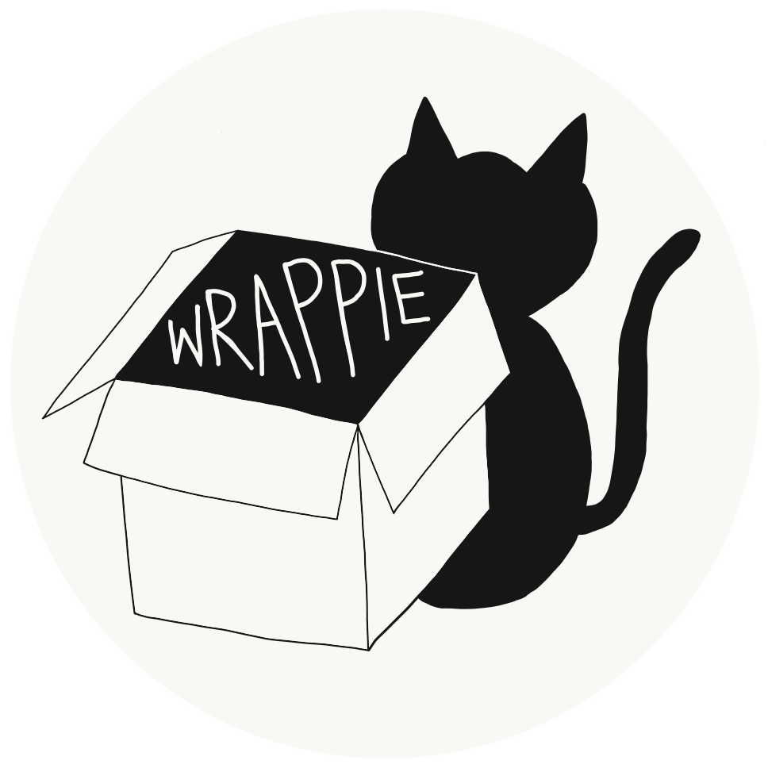

# wrappie



**wrappie** is a tool for automated deployment of applications using containers, bash wrappers and modules.  
Containers are used under the hood while users interact with modules, resulting in the typical user experience of a HPC shared system.

Find us on [GitHub](https://github.com/marcodelapierre/container-wrappers)


## Software requirements

* [Singularity](http://sylabs.io/singularity) : template installation [script](prereqs/install-singularity.sh)

* A module system, either 
    * [Environment modules](https://modules.readthedocs.io/en/latest/module.html) : template installation [script](prereqs/install-modules.sh)
    * [Lmod](https://lmod.readthedocs.io/en/latest/)


## Quick start

Edit the first few lines of the `setup.sh` script to provide values for the following variables:
* `rootdir`: upper level path for the directory tree of packages (containers and wrappers). The tree has the format: `rootdir/tool/tag/`
* `moduledir`: upper level path for the directory tree of modules, format `moduledir/tool/tag`
* `workdir`: work directory for production, where data are stored. Can be comma separated list, only used to display information

Write a text file, *e.g.* `list_apps`, of this form:

```
docker://ubuntu:18.04
- ls
- pwd
```

with image addresses, followed by a dashed list of commands you will need to run from that image. Lines starting with `#` will be ignored.

Finally run the script:

```
./setup.sh list_apps
```

At the end of the setup, the script will advise on a couple of variable definitions to be added in your `~/.bash_profile`, something like:

```
For proper functioning of this setup, ensure these two definitions are in your ~/.bash_profile :

##############################
module use [..]
export SINGULARITY_BINDPATH=$SINGULARITY_BINDPATH,[..]
##############################
```


## Useful resources

Checkout this tool to install containerised applications, including bash wrappers and modules: [Quay Containers](https://github.com/alexiswl/quay_containers).


## Authors

Marco De La Pierre <marco.delapierre@pawsey.org.au>  
Audrey Stott <audrey.stott@pawsey.org.au>  
Sarah Beecroft <sarah.beecroft@pawsey.org.au>  

Guess what? We are cat lovers!
